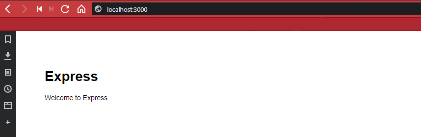
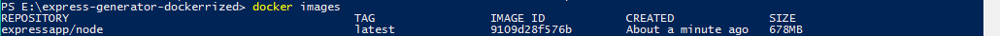
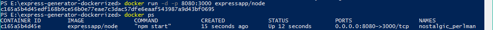
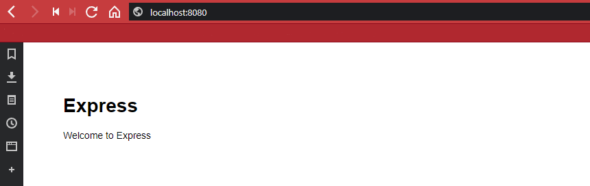

# How to wrap your Source Code into a Docker Container

As an example, we are going to use [express-generator](https://expressjs.com/en/starter/generator.html) to scaffold a [Node.js](https://nodejs.org) Web App and wrap it's source code into a Docker Container.


<!-- TOC -->

- [How to wrap your Source Code into a Docker Container](#how-to-wrap-your-source-code-into-a-docker-container)
  - [Create a Node.js Web App](#create-a-nodejs-web-app)
  - [Creating a Dockerfile for our App](#creating-a-dockerfile-for-our-app)
    - [FROM](#from)
    - [ENV](#env)
    - [COPY](#copy)
    - [WORKDIR](#workdir)
    - [RUN](#run)
    - [EXPOSE](#expose)
    - [ENTRYPOINT](#entrypoint)
  - [Building our custom Docker Image](#building-our-custom-docker-image)

<!-- /TOC -->


## Create a Node.js Web App

We want to use express-generator to generate a basic Node Web App. We first need to install the generator globally on our machine:


```bash
npm install -g express-generator
```

We then run express-generator to scaffold an app for use, using the [EJS Templating Engine](http://ejs.co) - check out [their website](https://expressjs.com/en/starter/generator.html) for more options - and put the source code into a folder named _express-generator-app-docker_:


```bash
express --view=ejs express-generator-dockerrized
```

To install dependencies we need to enter the created directory and run _npm install_ :

```bash
cd express-generator-dockerrized & npm install
```

We can test our web app by running _npm start_ and accessing _http://localhos:3000_ with a web browser:





## Creating a Dockerfile for our App

The [Dockerfile](https://docs.docker.com/engine/reference/builder/) is a text file that contains all the commands that the [docker build](https://docs.docker.com/develop/develop-images/dockerfile_best-practices/#build-context) command uses, in order, to build a our Docker image.


```dockerfile
FROM        node:latest
MAINTAINER  Mike Polinowski
ENV         NODE_ENV=production
ENV         PORT=3000
COPY        . /app
WORKDIR     /app
RUN         npm install
EXPOSE      3000
ENTRYPOINT  ["npm", "start"]
```

### FROM

We are using the [node](https://hub.docker.com/_/node/) Docker image as a base for our app. By just writing _[FROM](https://docs.docker.com/develop/develop-images/dockerfile_best-practices/#from)_ __node__ we will use the @latest version of Node.js available on the [Docker Hub](https://hub.docker.com) - [specify a version](https://hub.docker.com/r/library/node/tags/) when required - e.g. `node:latest`, `node:9.10.2`


### ENV

The [Environment Variable](https://docs.docker.com/develop/develop-images/dockerfile_best-practices/#env) can be used to set, e.g. the Node Envrionment. Our app, as created by express-generator, also allows to change the port, the application is running on, to a different value, depending on the environment port defined here (see _./bin/www_ for how this is done).

### COPY

[Copy](https://docs.docker.com/develop/develop-images/dockerfile_best-practices/#add-or-copy) copies the source code into a folder inside the container. The given example __. /app__ copies everything from the current directory into an _/app_ directory, that is generated inside the container.


### WORKDIR

The [Working Directory](https://docs.docker.com/develop/develop-images/dockerfile_best-practices/#workdir) sets the context where scripts are run. We are going to add an `npm install` step, that needs to be run in the directory that contains our _package.json_.


### RUN

The most common use-case for RUN is a _Node Application_ of `npm install`, to install our app dependencies, once our source code is copied into the container. 


### EXPOSE

This [exposes](https://docs.docker.com/develop/develop-images/dockerfile_best-practices/#expose) a port that our app will be reached through, once the container is running. When a __PORT__ was defined as a _Environment Variable_ (s. above), you can also use this value, by settings __EXPOSE $PORT__


### ENTRYPOINT

The [Entrypoint](https://docs.docker.com/develop/develop-images/dockerfile_best-practices/#entrypoint) allows you to configure a container that will run as an executable. Point it to the images main command. Since we installed our app through _express-generator_, the main file to run would be __./bin/www__. In our case, the file will be executed by `node ./bin/www`. But checking the generated _package.json_ file, we can see that we already have an NPM Script for that, that allows us to simply call __npm start__ instead.


## Building our custom Docker Image

First we need to make sure that our Docker Image does not get unnecessary file - especially the __node\_modules__ and __.git__ folder should be excluded. Just like with a [.gitignore](https://www.gitignore.io) file, that excludes folders and files from git commits, we can create a __.dockerignore__ file:


```
.git
Dockerfile*
node_modules
```

Now we can run the __docker build__ command.

```bash
docker build -f Dockerfile -t expressapp/node .
```

This will run the `build` function of Docker using the our Dockerfile (__Note__: you don't have to add the `-f` flag when naming your file _Dockerfile_. The flag is useful when you have more then one Dockerfiles for different scenarios and have to give them different names accordingly.). The `-t` flag adds a tag to the Docker image - this can be your docker hub username, or a build version, for internal use. The `.` in the end signifies that docker should search for your code in the current work directory.


You can check if the image was build by typing 


```
docker images
```





And run the container by typing:

```
docker run -d -p 8080:3000 expressapp/node
```
This command will run your container in `-d` daemon mode in the background and set the external port of your app to 8080 (the internal port is set by the express app to 3000). You can verify that your app is running by typing:

```
docker ps
```





You now have your app running inside the container and can access it by opening http://localhost:8080 inside your web browser:





You can stop and delete the container (the docker image stays in place - so you can always restart it) by:

```
docker stop c165

docker rm c165
```

The __c165__ are the first characters of the Container ID and can be used as a selector - of course, the ID will differ every time you rerun the container.


If you want to remove the complete image, you first have to check the image ID (just as shown above, you just need to type the first few characters to select the image - e.g. _9190_) by typing `docker images`, then delete it with `docker rmi 9190`